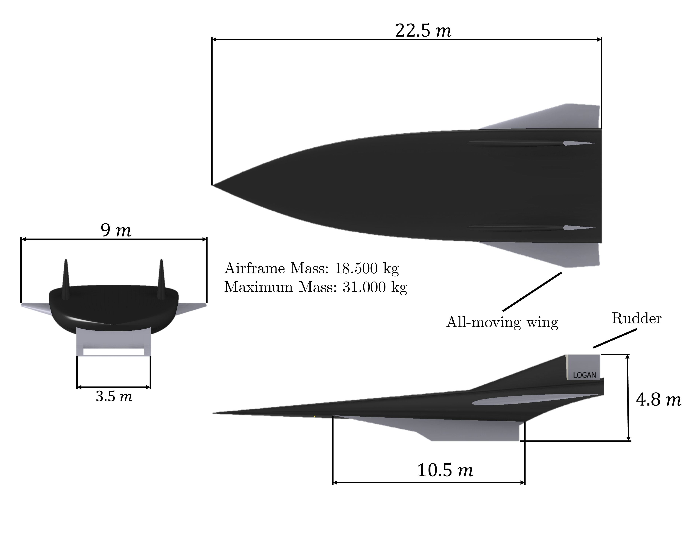
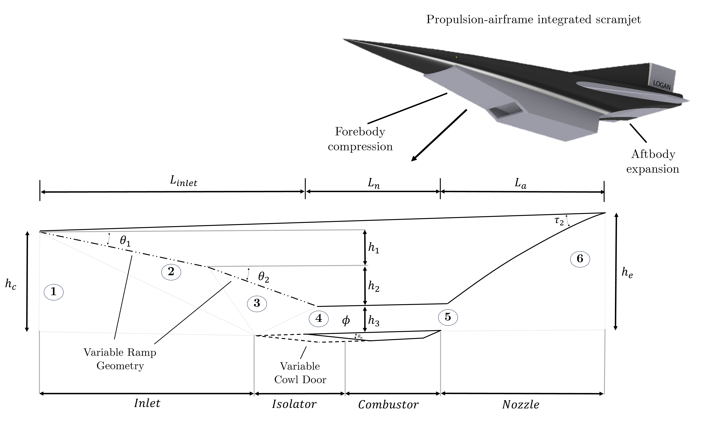
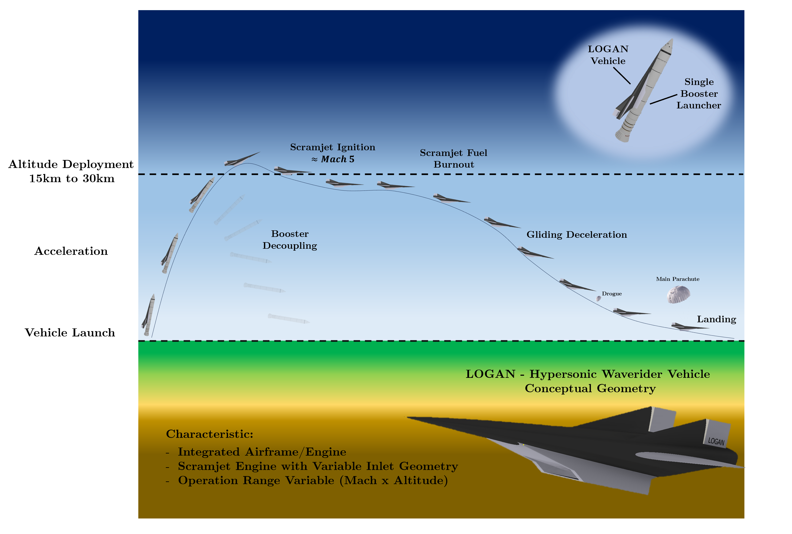
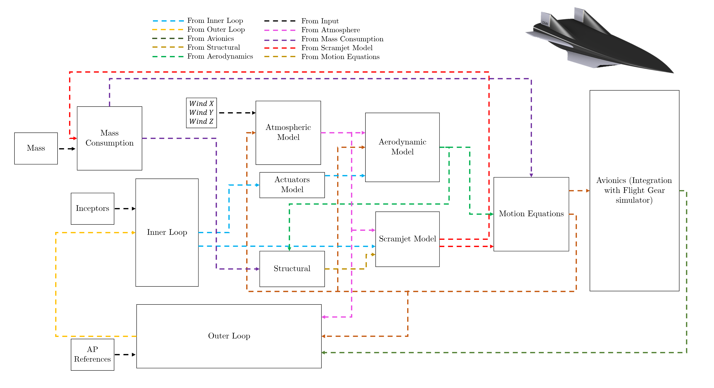
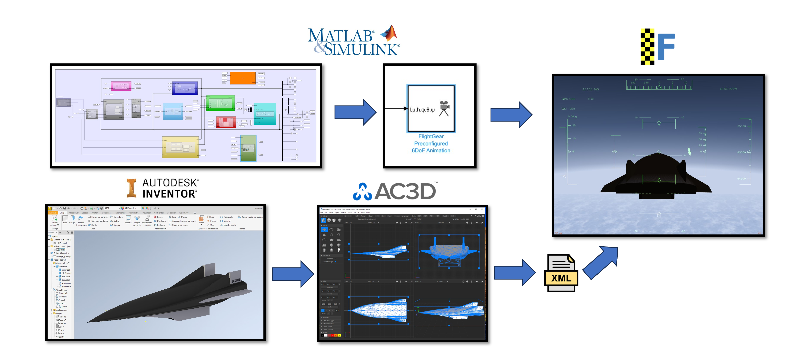
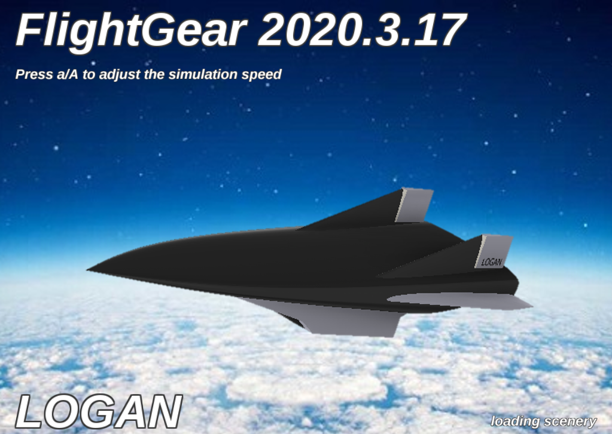

# LOGAN Hypersonic Vehicle Model

High-fidelity flight dynamics and scramjet-integrated simulation framework for a hypersonic vehicle.

  

# LOGAN Model Overview

The LOGAN (Large Over-Mach Glider Aircraft New-generation) model is a high-fidelity flight dynamics framework coupled with a thermodynamic scramjet engine model. The overall architecture integrates vehicle dynamics, propulsion, guidance, navigation, and control within a unified simulation environment.

The vehicle dynamics model is formulated with six degrees of freedom (6-DoF), while the scramjet engine is represented by a one-dimensional thermodynamic model. The system operates in closed loop along all axes, including longitudinal, lateral-directional, and propulsion dynamics.

In addition to the inner control loops, the model includes outer-loop autopilot controllers for both longitudinal and lateral motion, with support for waypoint-based navigation.

# Vehicle Geometry

The main dimensions of the conceptual LOGAN vehicle are shown in the figure below.

  
 
 <em>Figure 1. Conceptual dimensions of the LOGAN hypersonic vehicle.</em> 

# Scramjet Engine Model Discretization

The discretization and integration of the one-dimensional scramjet engine model within the overall framework are illustrated in the figure below.

  
 
 <em>Figure 2. Scramjet engine model discretization and integration.</em> 

# Mission Concept

The LOGAN model was developed assuming a boost-to-scramjet mission concept. In this scenario, the vehicle is launched by a booster that accelerates it to a predefined altitude and Mach number, at which point the scramjet engine computation and operation begin.

The conceptual mission profile is illustrated in the figure below.

  
 
 <em>Figure 3. Conceptual mission profile of the LOGAN vehicle.</em> 

# Integrated Simulink Architecture

The complete block diagram showing the correlations and interactions among all LOGAN subsystems, as implemented in logan.slx, is presented below.

  
 
 <em>Figure 4. Full integrated architecture of the LOGAN Simulink model.</em> 

# FlightGear Integration

The LOGAN model supports real-time visualization through integration with the FlightGear flight simulator. The integration architecture is shown in the figure below.

  
 
 <em>Figure 5. Integration between the LOGAN model and FlightGear.</em> 

To run the FlightGear integration, execute the runfg.bat script outside MATLAB. This script initializes the communication between the Simulink model and FlightGear.

# ⚠️ Important notes:

Correct configuration of the local FlightGear installation is required.

The reference setup was tested using FlightGear version 2020.3.

In the current release, the vehicle .ac geometry file is not provided. A generic .ac file must be generated if full visual fidelity is desired.

The model was developed and tested using MATLAB R2024b.

FlightGear is an open-source flight simulator, offering high flexibility and allowing extensive customization for advanced visualization and integration, as illustrated below.

  
 
 <em>Figure 6. FlightGear environment used for LOGAN visualization.</em> 

# How to Run the Model

The recommended execution workflow is as follows:

Run the script Logan_init.m

This script loads all global model parameters and allows modification of:

Reference mass
Moments of inertia
Autopilot configuration
Control modes and flags

Open the Main Model Logan.slx

This is the main model where the equations of motion and subsystem interactions are solved. For trim computation execute Logan_trim_m.

In this script, the following parameters must be specified:

Center of gravity position
Vehicle mass
Trim altitude
Mach number

⚠️ Care must be taken when modifying the center of gravity, as certain CG positions may result in unstable trim conditions.

# Simulation Execution

After trimming, simulations can be executed. Directly from the Simulink interface, or by running the example script:

Logan_sim.m

# Autopilot Modes

Longitudinal Autopilot

The longitudinal autopilot includes the following modes:

Mode 0: Disabled

Mode 1: Theta tracking mode

Mode 2: Altitude hold mode

Mode 3: Flight-path angle (gamma) tracking mode

The LOGAN vehicle operates in a hypersonic regime with low angles of attack, and therefore typically tracks small flight-path angles. This behavior was intentionally adopted to ensure proper scramjet inlet spill-flow conditions. To select the longitudinal mode, modify the variable PA_LongMode in Logan_init.m.

Lateral Autopilot

The lateral autopilot includes the following modes:

Mode 0: Disabled

Mode 1: Bank angle tracking

Mode 2: Waypoint navigation

For waypoint navigation, latitude and longitude coordinates are defined using the Waypoints matrix. The variable waypoint_idx specifies the target waypoint index.

Example:

Waypoints = [
    35.6895, 139.6917;   % Tokyo
    55.7558, 37.6173;    % Moscow
    48.8566, 2.3522;     % Paris
    51.5074, -0.1278;    % London
    45.5017, -73.5673;   % Montreal
    40.7128, -74.0060;   % New York
    34.0522, -118.2437;  % Los Angeles
    -23.5505, -46.6333;  % São Paulo
    -82.8628, 135.0000;  % Antarctica
    -33.9249, 18.4241;   % Cape Town
    -8.0476, -34.8770;   % Recife
];

Additional Model Options

The LOGAN framework also includes:

A simplified TECS (Total Energy Control System)

Enable using the flag TECS_ON = 1

Additional configurable options in Logan_init.m include:

Manual control using a joystick (manual control block must be uncommented)

Trimming enable/disable

Fuel consumption freeze using Fuel_freeze

The aircraft mass can also be selected among predefined configurations:

Heavy: 31,000 kg

Medium: 27,500 kg

Light: 21,000 kg

 # References and Further Reading

For detailed information regarding the modeling framework, flight dynamics formulation, propulsion integration, and control system design adopted in the LOGAN model, the reader is referred to the following works:

Moura, E. F., 2025. A Fully Integrated Thermodynamic and Dynamic Model for Hypersonic Vehicle Simulation. Ph.D. Thesis, Space Science and Technology, Aeronautical Institute of Technology, São José dos Campos, Brazil.
Available at: https://www.researchgate.net/publication/396219376_A_FULLY_INTEGRATED_THERMODYNAMIC_AND_DYNAMIC_MODEL_FOR_HYPERSONIC_VEHICLE_SIMULATION

Moura, E. F., and Ribeiro, G. B., 2025a. Flight Control Longitudinal Law for a Hypersonic Waverider Vehicle. Proceedings of the 28th ABCM International Congress of Mechanical Engineering (COBEM 2025), Curitiba, Brazil, November 9–13, Paper ID: COBEM2025-0300.
Available at: https://www.researchgate.net/publication/397635304_FLIGHT_CONTROL_LONGITUDINAL_LAW_FOR_A_HYPERSONIC_WAVERIDER_VEHICLE

Moura, E. F., and Ribeiro, G. B., 2025b. Hypersonic Waverider Vehicle Flight Control Lateral-Directional Law Implementation. Proceedings of the 28th ABCM International Congress of Mechanical Engineering (COBEM 2025), Curitiba, Brazil, November 9–13, Paper ID: COBEM2025-0360.
Available at: https://www.researchgate.net/publication/397635842_HYPERSONIC_WAVERIDER_VEHICLE_FLIGHT_CONTROL_LATERAL-DIRECTIONAL_LAW_IMPLEMENTATION

Moura, E. F., and Ribeiro, G. B., 2025c. Scramjet Engine Control Law for a Hypersonic Waverider Vehicle. Proceedings of the 28th ABCM International Congress of Mechanical Engineering (COBEM 2025), Curitiba, Brazil, November 9–13, Paper ID: COBEM2025-1480.
Available at: https://www.researchgate.net/publication/397651015_SCRAMJET_ENGINE_CONTROL_LAW_FOR_A_HYPERSONIC_WAVERIDER_VEHICLE

Moura, E. F., and Ribeiro, G. B., 2025d. Hypersonic Waverider Vehicle Flight Control Autopilot System Design and Implementation. Proceedings of the 28th ABCM International Congress of Mechanical Engineering (COBEM 2025), Curitiba, Brazil, November 9–13, Paper ID: COBEM2025-1507.
Available at: https://www.researchgate.net/publication/397649782_HYPERSONIC_WAVERIDER_VEHICLE_FLIGHT_CONTROL_AUTOPILOT_SYSTEM_DESIGN_AND_IMPLEMENTATION

Moura, E. F., and Ribeiro, G. B., 2025e. Total Energy Control System for a Hypersonic Waverider Vehicle. Proceedings of the 28th ABCM International Congress of Mechanical Engineering (COBEM 2025), Curitiba, Brazil, November 9–13, Paper ID: COBEM2025-1499.
Available at: https://www.researchgate.net/publication/397650860_TOTAL_ENERGY_CONTROL_SYSTEM_FOR_A_HYPERSONIC_WAVERIDER_VEHICLE

Moura, E. F., and Ribeiro, G. B., 2026. Thermodynamic–dynamic coupling and exergy analysis during transient maneuvers of a hypersonic vehicle. Aerospace Science and Technology, Vol. 168, Article 110869.
DOI: 10.1016/j.ast.2025.110869
Available at: https://www.sciencedirect.com/science/article/abs/pii/S1270963825009332

## License

This project is provided for academic and research purposes only.

Commercial use, redistribution, or modification of the source code is not
permitted without explicit authorization from the author.

See the LICENSE file for details.

# Conceptual View of the LOGAN Vehicle

  
 
 <em>Figure 7. Conceptual view of the LOGAN hypersonic waverider vehicle.</em> 

