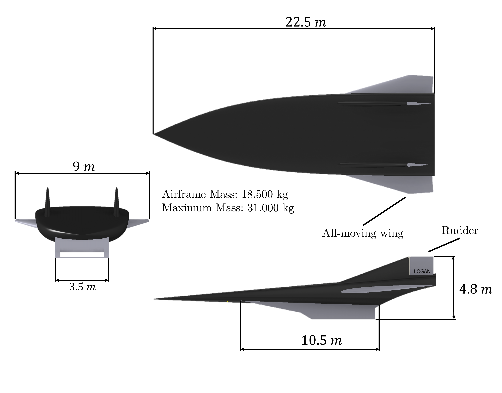
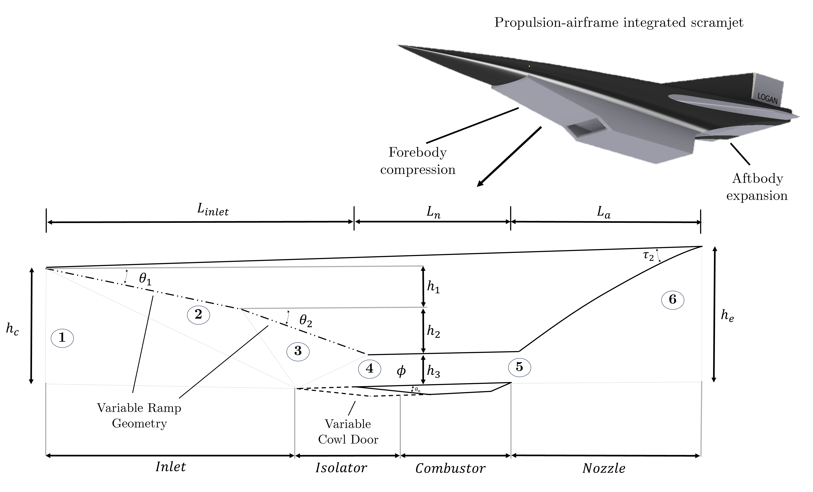
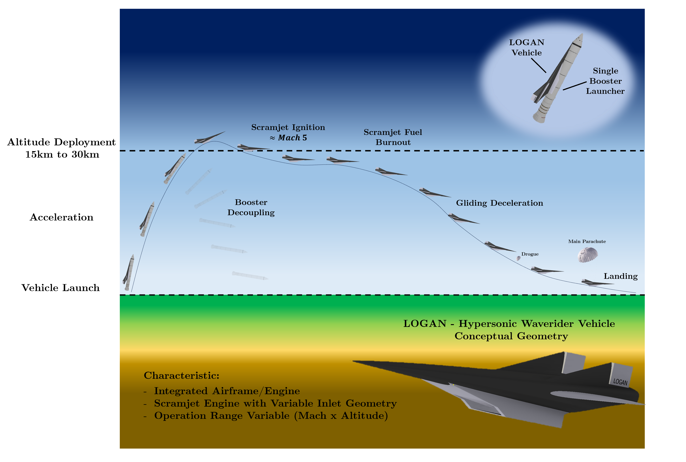
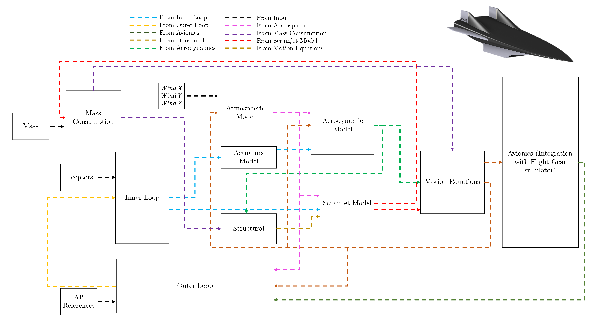
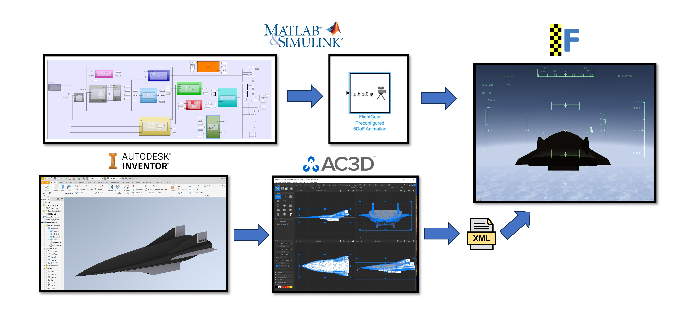
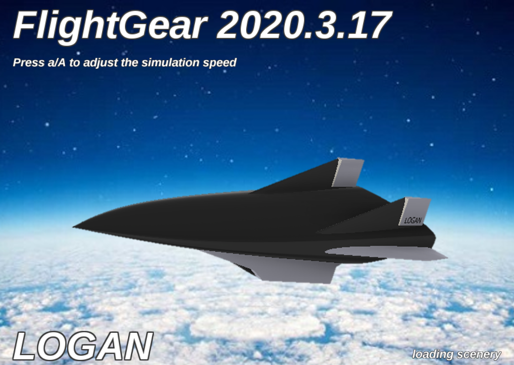
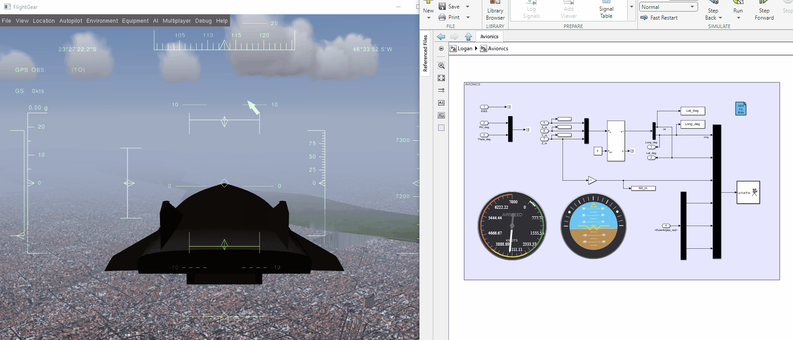

  

# LOGAN 

<!-- badges: start -->

<!-- badges: end -->

The **LOGAN Hypersonic Vehicle Model** is a fully integrated dynamic and thermodynamic framework for the simulation, analysis, and control of the LOGAN hypersonic vehicle.

 

 

  

# How to Cite

For information on how to cite the LOGAN model and the scientific publications underlying its formulation and subsystems, please consult the [**CITATION GUIDELINES**](HOW_TO_CITE.md).

# LOGAN Model Overview

The LOGAN (Large Over-Mach Glider Aircraft New-generation) model is a flight dynamics framework coupled with a thermodynamic scramjet engine model. The overall architecture integrates vehicle dynamics, propulsion, guidance, navigation, and control within a unified simulation environment.

The vehicle dynamics model is formulated with six degrees of freedom (6-DoF), while the scramjet engine is represented by a one-dimensional thermodynamic model. The system operates in closed loop along all axes, including longitudinal, lateral-directional, and propulsion dynamics.

In addition to the inner control loops, the model includes outer-loop autopilot controllers for both longitudinal and lateral motion, with support for waypoint-based navigation.

# Vehicle Geometry

The main dimensions of the conceptual LOGAN vehicle are shown in the figure below.

  
 
 <em>Figure 1. Conceptual dimensions of the LOGAN hypersonic vehicle.</em> 

# Scramjet Engine Model Discretization

The discretization and integration of the one-dimensional scramjet engine model within the overall framework are illustrated in the figure below.

  
 
 <em>Figure 2. Scramjet engine model discretization and integration.</em> 

# Mission Concept

The LOGAN model was developed assuming a boost-to-scramjet mission concept. In this scenario, the vehicle is launched by a booster that accelerates it to a predefined altitude and Mach number, at which point the scramjet engine computation and operation begin.

The conceptual mission profile is illustrated in the figure below.

  
 
 <em>Figure 3. Conceptual mission profile of the LOGAN vehicle.</em> 

# Integrated Simulink Architecture

The complete block diagram showing the correlations and interactions among all LOGAN subsystems, as implemented in logan.slx, is presented below.

  
 
 <em>Figure 4. Full integrated architecture of the LOGAN Simulink model.</em> 

# FlightGear Integration

The LOGAN model supports real-time visualization through integration with the FlightGear flight simulator. The integration architecture is shown in the figure below.

  
 
 <em>Figure 5. Integration between the LOGAN model and FlightGear.</em> 

> **Note:** Detailed instructions for configuring and running the FlightGear integration are provided in the [**FlightGear Configuration**](#flightgear-configuration) section.

# Prerequisites

The LOGAN model was developed and tested using the following software and MATLAB environment:

| Software | Version |
|---|---|
| MATLAB | R2024b |
| Simulink | R2024b |
| Aerospace Toolbox | R2024b |
| FlightGear Simulator | 2020.3.17 |

> **Note:** The model is expected to operate normally with newer MATLAB versions, provided that the Simulink model is converted to the corresponding version. FlightGear 2024.1 is also expected to be compatible with the LOGAN framework.

# FlightGear Configuration

The LOGAN framework can be integrated with the FlightGear flight simulator for three-dimensional visualization of the simulated vehicle. The following steps describe the configuration required to run FlightGear with the LOGAN Simulink model.

The `runfg.bat` file included with the LOGAN model contains the configuration required to launch FlightGear. Before running the simulation, edit this file to match the FlightGear installation path on your computer. For example:

~~~bat
C:\FlightGear 2020.3
~~~

The `runfg.bat` file can also be modified to enable additional FlightGear options, such as sound, clouds, and other simulation settings. For further information, please refer to the [**FlightGear Wiki**](https://wiki.flightgear.org/Main_Page).

> **Note:** The **Generate Run Script** block available under `Logan/Avionics` is provided by the Aerospace Toolbox and contains an example configuration. The example shown in the Simulink model is not specific to LOGAN; the `runfg.bat` file included with this project has already been configured for LOGAN and only requires adjustments to your local installation and desired FlightGear options.

To configure the generic LOGAN aircraft, locate the `Logan` folder inside the `FG_files` directory of the repository and copy it into the `Aircraft` directory of your FlightGear installation:

~~~text
<FlightGear installation directory>\data\Aircraft
~~~

> **Note:** The exact location of the `Aircraft` directory depends on the FlightGear version and the installation path on your computer.

Inside `Logan/Models`, the `Logan.ac` file contains the three-dimensional geometry used for visualization.

> **Note:** The `Logan.ac` geometry is provided for visualization purposes only. It is a generic representation of the vehicle and is not intended to reproduce the latest vehicle configuration with complete geometric fidelity.

The `Logan-set.xml` and `Logan.xml` files contain basic FlightGear configuration parameters and can be edited to modify the available settings. This allows different configurations to be implemented according to the user's requirements. In the current version, these files contain the generic vehicle geometry and a default visualization configuration.

Once the configuration is complete, right-click the `runfg.bat` file and select `Open Outside MATLAB` to launch FlightGear with the configured LOGAN environment. A FlightGear window will then open and begin loading the simulation environment, as shown in Figure 6.

  

  <em>Figure 6. FlightGear environment used for LOGAN visualization.</em>

Once FlightGear is fully loaded and the simulation is running, the LOGAN vehicle can be visualized in the simulator. Press `V` to change the camera view and `H` to enable the Head-Up Display (HUD).

  

  <em>Figure 7. LOGAN vehicle visualization in FlightGear.</em>

# How to Run the Model

The LOGAN model is composed of MATLAB scripts, Simulink models, and pre-computed trim data. The main files and their respective functions are summarized below.

| File | Description |
|---|---|
| `Logan_init.m` | Initializes the model by loading the vehicle dimensional parameters, moments of inertia, physical properties, and autopilot configurations. |
| `Logan_trim.m` | Performs the aircraft trim procedure by defining the vehicle mass, altitude, Mach number, and center of gravity (CG). |
| `TrimDatabase_Logan.mat` | Contains pre-computed trim points for Mach numbers from 5 to 10 and altitudes from 50,000 to 100,000 ft, within the defined flight envelope. |
| `acess_trimFiles.m` | Provides a convenient interface for selecting and loading predefined trim conditions from `TrimDatabase_Logan.mat`. It can also be used as an example for developing batch simulations. |
| `Logan.slx` | Main Simulink model containing the vehicle equations of motion and the interactions among the different subsystems. |
| `Logan_sim.m` | Example MATLAB script for running batch simulations and generating simulation results and plots. |
| `FlightEnvelope.fig` | Flight-envelope figure showing the trim points available for the LOGAN model. |
| `Vn_diagram.fig` | Conceptual example of the vehicle's V–n diagram. |

The `Logan_init.m` script should be executed first. It loads the main vehicle parameters and provides the initial configuration required by the model, including dimensional properties, moments of inertia, and autopilot settings.

The `Logan_trim.m` script is used to trim the aircraft by defining the vehicle mass, altitude, Mach number, and center of gravity (CG). The following mass conditions were adopted as the primary design points for the vehicle and its flight-control system:

| Configuration | Vehicle Mass |
|---|---:|
| Light | 21,000 kg |
| Medium | 27,500 kg |
| Heavy | 31,000 kg |

The light, medium, and heavy configurations were selected as design points, representing the aircraft’s weight-envelope boundary and nominal conditions. Other aircraft masses may also be used in simulations within the range from 18,500 kg to 31,000 kg, where 18,500 kg represents the structural mass and therefore corresponds to zero onboard fuel. Fuel consumption is enabled by default and is governed by the fuel mass flow rate. During the simulation, the vehicle mass decreases according to the fuel consumption, while the moments of inertia are scaled proportionally to the vehicle mass fraction.

> **Note:** Care must be taken when modifying the center of gravity, as changing the **CG position** may result in unstable trim conditions.

To facilitate model execution and reduce simulation time, a database of pre-computed trim conditions is provided in `TrimDatabase_Logan.mat`. The database contains trim points for Mach numbers ranging from 5 to 10 and altitudes from 50,000 to 100,000 ft, according to the defined flight-envelope constraints. Refer to this file for the available trim conditions.

The `acess_trimFiles.m` script provides an example of how to select and load predefined trim conditions from the database. It can also be adapted for automated or batch simulations using different trim conditions.

The complete LOGAN model and its subsystems were developed in Simulink. Standard Simulink blocks are used throughout the model, while specific subsystems, such as the propulsion system, also incorporate `MATLAB Function` blocks for the implementation of dedicated computational routines.

Once the aircraft has been trimmed, the simulation can be started directly from the Simulink interface by pressing `Play` and selecting the desired simulation time.

> **Note:** The Simulink pacing is configured to allow simulations to run faster than real time. To visualize the simulation in real time, set the pacing value to `1`.

For three-dimensional visualization, open `Logan.slx`, load the `logan_int` configuration, and either perform a new trim or load a predefined trim condition using `acess_trimFiles.m`. Then execute the `runfg.bat` script to launch FlightGear and press `Play` in Simulink. The resulting FlightGear visualization is described in the [**FlightGear Configuration**](#flightgear-configuration) section.

The model can also be executed through MATLAB scripts, which facilitates batch simulations and automated result generation. The `Logan_sim.m` script provides an example of this approach. Running this script executes a 300 s simulation and generates several plots, including the aircraft dynamic response, engine thermodynamic response, and other simulation results.

The execution of `Logan_sim.m` is expected to produce the example results shown below.

  

  <em>Figure 8. Example simulation results generated by Logan_sim.m.</em>

If the simulation does not work as expected after following these instructions, or if you have any questions, please [**contact us by email**](mailto:ermerson@ita.br). If you identify a bug, please refer to the [**contributing guidelines**](CONTRIBUTING.md) for information on how to report it.

## Cheatsheet

The cheat sheet below provides a quick reference for configuring and running the LOGAN model.

# Autopilot Modes

The LOGAN model includes longitudinal and lateral-directional autopilot modes, which can be selected through the corresponding configuration variables in `Logan_init.m`.

### Longitudinal Autopilot

| Mode | Description |
|---:|---|
| 0 | Disabled |
| 1 | Theta tracking |
| 2 | Altitude hold |
| 3 | Flight-path angle (`gamma`) tracking |

To select the longitudinal autopilot mode, set the `PA_LongMode` variable in `Logan_init.m`. The corresponding reference can be defined using the following parameters:

| Variable | Description |
|---|---|
| `AltPoint` | Reference altitude for altitude-hold mode. |
| `ThetaPoint` | Reference pitch angle (`theta`) for theta-tracking mode. |
| `GammaRef_deg` | Reference flight-path angle (`gamma`) for flight-path angle tracking. |

The LOGAN vehicle operates in the hypersonic regime with low angles of attack and therefore typically tracks small flight-path angles. This behavior was intentionally adopted to maintain appropriate scramjet inlet spill-flow conditions.

### Lateral-Directional Autopilot

| Mode | Description |
|---:|---|
| 0 | Disabled |
| 1 | Bank-angle tracking |
| 2 | Waypoint navigation |

To select the lateral-directional autopilot mode, set the `PA_LatMode` variable in `Logan_init.m`.

For bank-angle tracking, the reference bank angle is defined using `PhiPoint`.

For waypoint navigation, latitude and longitude coordinates are specified in the `Waypoints` matrix, while `Waypoint_idx` selects the active waypoint from the list.

Example:

~~~matlab
Waypoints = [
    35.6895, 139.6917;    % Tokyo
    55.7558, 37.6173;     % Moscow
    48.8566, 2.3522;      % Paris
    51.5074, -0.1278;     % London
    45.5017, -73.5673;    % Montreal
    40.7128, -74.0060;    % New York
    34.0522, -118.2437;   % Los Angeles
    -23.5505, -46.6333;   % São Paulo
    -82.8628, 135.0000;   % Antarctica
    -33.9249, 18.4241;    % Cape Town
    -8.0476, -34.8770;    % Recife
];
~~~

### Engine Control

The engine control mode is selected using `PA_EngineMode`:

| Mode | Description |
|---:|---|
| 0 | Mach-tracking control disabled |
| 1 | Mach-tracking control enabled |

The `MachPoint` variable defines the Mach reference used by the engine control system.

### Total Energy Control System (TECS)

The LOGAN framework includes a simplified Total Energy Control System (TECS), which can be enabled using `TECS_ON = 1`.

The `PA_TECSEngineInput` variable provides the acceleration/deceleration reference to the TECS loop.

# Model Flags and Options

Additional model features can be configured through the following flags in `Logan_init.m`.

| Option | Flag | Description |
|---|---|---|
| Manual Control | `Manual_Control` | Enables manual control using a joystick. Set the flag to `1` and uncomment the manual-control block in the Simulink model. |
| Trimming | `Trimming` | Enables the trimming procedure when set to `1`. |
| Fuel Freeze | `Fuel_Freeze` | Freezes fuel consumption when set to `1`. |

# References and Further Reading

For detailed information regarding the modeling framework, flight dynamics formulation, propulsion integration, and control system design adopted in the LOGAN model, the reader is referred to the following works:

Moura, E.F. and Ribeiro, G.B. (2026) ‘Thermodynamic–dynamic coupling and exergy analysis during transient maneuvers of a hypersonic vehicle’, Aerospace Science and Technology, 168, 110869. Available at: https://doi.org/10.1016/j.ast.2025.110869

Moura, E.F. and Ribeiro, G.B. (2026) ‘Aerodynamic and dynamic analysis of a hypersonic waverider with a coupled dynamic–thermodynamic model’, Aerospace Science and Technology, 178, 112481. Available at: https://doi.org/10.1016/j.ast.2026.112481

Moura, E.F. and Ribeiro, G.B. (2026) ‘Transient thermodynamic–dynamic modeling and exergy analysis of a waverider hypersonic vehicle’, Aerospace Systems, pp. 1–22. Available at: https://doi.org/10.1007/s42401-026-00510-0

Moura, E.F. (2025) ‘A fully integrated thermodynamic and dynamic model for hypersonic vehicle simulation’. PhD thesis, Space Science and Technology, Aeronautical Institute of Technology, São José dos Campos, Brazil. Available at: https://doi.org/10.13140/RG.2.2.25090.95682

Moura, E.F. and Ribeiro, G.B. (2025) ‘Flight control longitudinal law for a hypersonic waverider vehicle’. Proceedings of the 28th ABCM International Congress of Mechanical Engineering (COBEM 2025), Curitiba, Brazil, 9–13 November. Paper ID: COBEM2025-0300. Available at: https://doi.org/10.26678/ABCM.COBEM2025.COB2025-0300

Moura, E.F. and Ribeiro, G.B. (2025) ‘Hypersonic waverider vehicle flight control lateral-directional law implementation’. Proceedings of the 28th ABCM International Congress of Mechanical Engineering (COBEM 2025), Curitiba, Brazil, 9–13 November. Paper ID: COBEM2025-0360. Available at: https://doi.org/10.26678/ABCM.COBEM2025.COB2025-0360

Moura, E.F. and Ribeiro, G.B. (2025) ‘Scramjet engine control law for a hypersonic waverider vehicle’. Proceedings of the 28th ABCM International Congress of Mechanical Engineering (COBEM 2025), Curitiba, Brazil, 9–13 November. Paper ID: COBEM2025-1480. Available at: https://doi.org/10.26678/ABCM.COBEM2025.COB2025-1480

Moura, E.F. and Ribeiro, G.B. (2025) ‘Hypersonic waverider vehicle flight control autopilot system design and implementation’. Proceedings of the 28th ABCM International Congress of Mechanical Engineering (COBEM 2025), Curitiba, Brazil, 9–13 November. Paper ID: COBEM2025-1507. Available at: https://doi.org/10.26678/ABCM.COBEM2025.COB2025-1507

Moura, E.F. and Ribeiro, G.B. (2025) ‘Total energy control system for a hypersonic waverider vehicle’. Proceedings of the 28th ABCM International Congress of Mechanical Engineering (COBEM 2025), Curitiba, Brazil, 9–13 November. Paper ID: COBEM2025-1499. Available at: https://doi.org/10.26678/ABCM.COBEM2025.COB2025-1499

Moura, E.F. and Ribeiro, G.B. (2026) ‘Cooling system model integrated into the complete simulation framework of a hypersonic vehicle’. Proceedings of the 8th Escola de Verão de Refrigeração, São José dos Campos, Brazil, 23–25 February. Available at: https://doi.org/10.26678/ABCM.EVR2026.EVR26-0014

# License

LOGAN is licensed under the BSD 3-Clause License. See [**LICENSE**](https://github.com/ermersonmoura/LOGAN-Hypersonic-Vehicle-Model/blob/main/LICENSE) for details.

# How to Contribute

Interested in contributing to the LOGAN project or reporting an issue? Please see the [**CONTRIBUTING GUIDELINES**](CONTRIBUTING.md) for further information.

# LOGAN Vehicle Conceptual View

  
 
 <em>Figure 9. Conceptual view of the LOGAN hypersonic waverider vehicle.</em> 

---- 

