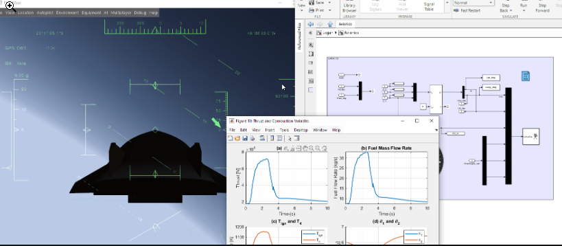

# Summary
Hypersonic vehicle simulation remains challenging due to the strong coupling between flight dynamics and propulsion, particularly for scramjet-powered waverider configurations. In these vehicles, the thermodynamic behavior of the scramjet engine directly affects the vehicle flight dynamics, while changes in the flight condition simultaneously influence engine operation. The LOGAN (Large Over-Mach Glider Aircraft New-generation) Hypersonic Vehicle Model addresses this interaction through a fully integrated dynamic and thermodynamic framework that couples a six-degree-of-freedom flight dynamics model with a one-dimensional scramjet engine thermodynamic model. The framework enables coupled simulation, analysis, and control of the vehicle and can support preliminary hypersonic vehicle studies, control-system development, and evaluation of transient operating conditions. Its modular structure also facilitates the modification and extension of individual model components.

# Introduction
Hypersonic flight has been investigated since the 1960s and remains a major research topic in aerospace engineering. In recent years, growing interest in high-speed atmospheric flight has reinforced hypersonic technology as a strategic area for both civilian and military applications [@Ding2022]. Air-breathing hypersonic vehicles are particularly relevant because they enable sustained atmospheric flight at hypersonic speeds and may contribute to future developments in rapid transportation, defense systems, and access-to-space technologies.

Despite these opportunities, air-breathing hypersonic vehicles remain less technologically mature than conventional aircraft. Their operation involves highly coupled aerodynamic, propulsion, thermal, and flight-dynamic phenomena that become increasingly important as flight speed and altitude vary. Understanding this behavior therefore requires more than analyzing individual subsystems in isolation; the interactions among them must also be considered throughout the flight condition.

In this context, integrated simulation plays an important role in the development of hypersonic systems. A holistic representation of the vehicle can support the analysis of coupled aero-propulsive behavior, the assessment of control strategies, and the investigation of vehicle response across different operating conditions. This capability is particularly important for scramjet-powered waveriders, in which propulsion and flight dynamics are strongly interconnected.

# Statement of Need
Hypersonic flight, particularly for air-breathing waverider configurations, involves strong interactions between vehicle dynamics and propulsion. Changes in flight conditions directly affect scramjet thermodynamic behavior, while engine operation influences the forces and moments acting on the vehicle. As a result, these systems are difficult to assess independently when the objective is to capture the overall vehicle response.

A framework that couples flight dynamics with scramjet thermodynamics is therefore needed for integrated analysis of hypersonic vehicles. Such a tool can support the development and evaluation of flight-control, guidance, and navigation strategies while providing a common environment for investigating the effects of propulsion on vehicle dynamics.

# State of the Field
The literature includes a wide range of hypersonic vehicle models, from simplified control-oriented formulations to more detailed aeroelastic and aeropropulsive models. Early work by Chávez and Schmidt introduced integrated aeropropulsive and aeroelastic effects [@ChavezSchmidt1992], while Bolender and Doman developed a nonlinear longitudinal model including detailed aerodynamic and propulsion formulations [@BolenderDoman2007]. Later studies expanded these approaches to six-degree-of-freedom formulations, including aerodynamic databases and flexible vehicle dynamics [@Keshmiri2005; @ZhangZhangDing2020]. Despite these advances, flight-dynamics models and scramjet thermodynamic models are still commonly developed separately.

The coupling between these domains is particularly relevant for air-breathing hypersonic vehicles, where changes in flight conditions affect engine operation and propulsion directly influences vehicle dynamics. LOGAN brings these elements together in a single open-source framework, combining 6-DoF flight dynamics, aerodynamics, scramjet thermodynamics, and flight control for integrated simulation and analysis.

# LOGAN Model Overview
The LOGAN vehicle is a conceptual air-breathing hypersonic waverider that couples nonlinear six-degree-of-freedom (6-DoF) flight dynamics with a one-dimensional scramjet thermodynamic model. The vehicle is 22.5 m long, has a 9 m wingspan, and a maximum mass of 31,000 kg, including 18,500 kg of structural mass. The conceptual mission profile is illustrated below.

The flight dynamics are described by the standard nonlinear six-degree-of-freedom (6-DoF) rigid-body formulation [@EtkinReid1996; @Nelson1998]. The state vector is

$$
\mathbf{X} =
[x^E,\ y^E,\ z^E,\ \phi,\ \theta,\ \psi,\ u,\ v,\ w,\ p,\ q,\ r]^T.
$$

The vehicle dynamics are obtained from the coupled resolution of the aerodynamic and propulsive forces and moments acting on the vehicle. 
The complete mathematical model is implemented in MATLAB/Simulink and can be connected to FlightGear for real-time three-dimensional visualization. An example of the resulting simulation is shown below.

# Software Design

The framework was developed in MATLAB/Simulink using a block-diagram-based modeling approach. Simulink provides a graphical environment for modeling and simulating dynamic systems, facilitating the interconnection of the different vehicle subsystems and their interactions.

The integrated architecture combines the six-degree-of-freedom (6-DoF) flight dynamics model with aerodynamic, atmospheric, mass, scramjet, and flight-control models. The modular structure allows individual subsystems to be modified or replaced with limited impact on the remainder of the model, facilitating maintenance, model refinement, and future extensions. The main interactions among the subsystems are illustrated below.

A main design trade-off is the dependence on MATLAB/Simulink. The graphical modeling environment facilitates subsystem integration, modification, and maintenance, but MATLAB requires a proprietary license. In addition, Simulink models may require conversion when opened in a different MATLAB release, which limits portability compared with implementations based on open-source environments.

# Research Impact Statement

The LOGAN framework has supported a series of studies on flight control, autopilot functions, scramjet thermodynamics, aerodynamics, flight dynamics, and thermal management [@Moura2025; @MouraRibeiro2025a; @MouraRibeiro2025b; @MouraRibeiro2025c; @MouraRibeiro2025d; @MouraRibeiro2025e; @MouraRibeiro2026a; @MouraRibeiro2026b; @MouraRibeiro2026c; @MouraRibeiro2026d]. These publications have begun to receive citations, providing an initial measurable indication of the scientific impact of the work.

As an open-source and modular framework, LOGAN can also be used as a basis for further research. Its architecture allows researchers to test new models, refine subsystem fidelity, and develop and evaluate flight-control, guidance, and navigation methods within an integrated hypersonic simulation environment.

# AI Usage Disclosure

Artificial intelligence tools were used to assist with syntax error resolution, text correction and translation, clarification of MATLAB functions, and adjustments to scripts used for generating simulation results. All AI-assisted outputs were reviewed, tested, and independently validated by the author.

# Acknowledgements

The author gratefully acknowledges the Aeronautics Institute of Technology (ITA) for the academic and research environment in which this work was developed, and Prof. Guilherme Borges Ribeiro for his supervision and guidance throughout the doctoral research that led to the development of the LOGAN framework.

# Conclusion

LOGAN provides an open-source framework for coupled hypersonic flight dynamics and scramjet thermodynamic simulation. Its integrated and modular structure supports the analysis of aero-propulsive interactions and the development and evaluation of control and navigation strategies. The framework is intended as a basis for further research and refinement of hypersonic vehicle simulation models.

# References